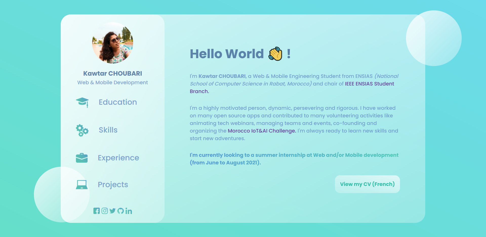

# Glassmorphism-Portfolio
This is a static HTML/CSS Glassmorphism Portfolio based on @developedbyed [tutorial](https://www.youtube.com/watch?v=O7WbVj5apxU).

## Sample Screenshot :

  

### **Live [DEMO](https://choubari.github.io/Glassmorphism-Portfolio/)**.

#
You can also check this interesting Medium Article about [Glassmorphism in user interfaces](https://uxdesign.cc/glassmorphism-in-user-interfaces-1f39bb1308c9) by Michal Malewicz through UX Collective.
#

